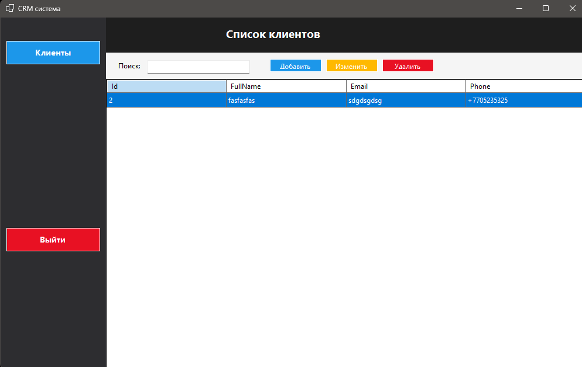
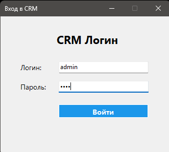

# CRM System (WinForms + C# + EF Core)
---
- CRM-система на Windows Forms:
- Управление клиентами (просмотр, добавление, редактирование, удаление)
- SQLite база данных
---
- CRM system based on Windows Forms:
- Customer management (view, add, edit, delete)
- SQLite database
---
## Структура проекта
- **CRM.WinForms** — пользовательский интерфейс
- **CRM.Application** — логика и сервисы
- **CRM.Domain** — модели и сущности
- **CRM.Infrastructure** — база данных (EF Core)
- **CRM.Common** — вспомогательные классы
---
## Project structure
- **CRM.WinForms** — user interface
- **CRM.Application** — logic and services
- **CRM.Domain** — models and entities
- **CRM.Infrastructure** — database (EF Core)
- **CRM.Common** — auxiliary classes
---
## NuGet Packages
- dotnet add CRM.WinForms package Microsoft.Extensions.DependencyInjection
- dotnet add CRM.WinForms package Microsoft.Extensions.Configuration
- dotnet add CRM.WinForms package Microsoft.Extensions.Configuration.Json
- dotnet add CRM.Common package Microsoft.Extensions.Logging
- dotnet add CRM.WinForms package Microsoft.EntityFrameworkCore
- dotnet add CRM.WinForms package Microsoft.EntityFrameworkCore.Sqlite
- dotnet add CRM.Infrastructure package Microsoft.EntityFrameworkCore
- dotnet add CRM.Infrastructure package Microsoft.EntityFrameworkCore.Sqlite
- dotnet add CRM.Infrastructure package Microsoft.EntityFrameworkCore.Tools
- dotnet add CRM.Infrastructure package Microsoft.Extensions.Logging.Console
---
## Для запуска:
1. Скопируйте репозиторий
2. Установите все NuGet Packages
3. Запустите приложение
4. Если выйдите с приложухи(логин - admin; пароль - 1234)
---
## To run:
1. Copy the repository
2. Install all NuGet Packages
3. Launch the app
4. If you log out of the application (login - admin; password - 1234)
---
## Screen App
---
### Список клиентов

### Окно входа

---