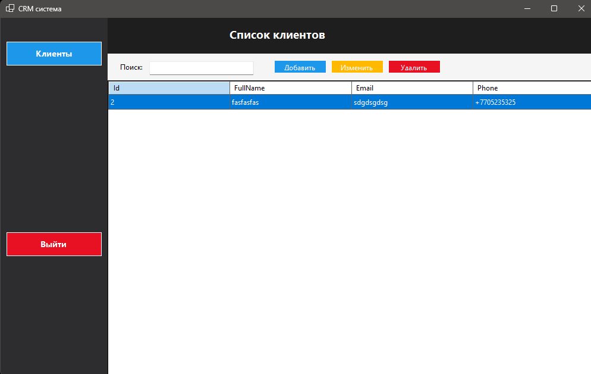
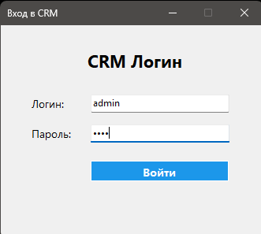

# CRM System (WinForms + C# + EF Core)
---
- CRM-система на Windows Forms:
- Управление клиентами (просмотр, добавление, редактирование, удаление)
- SQLite база данных
---
- CRM system based on Windows Forms:
- Customer management (view, add, edit, delete)
- SQLite database
---
## Screen App
---
### Список клиентов

### Окно входа

---
